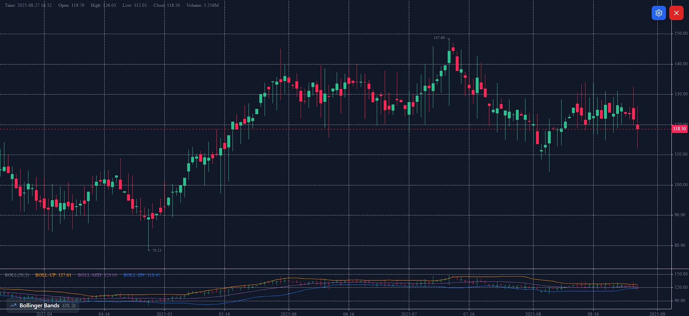
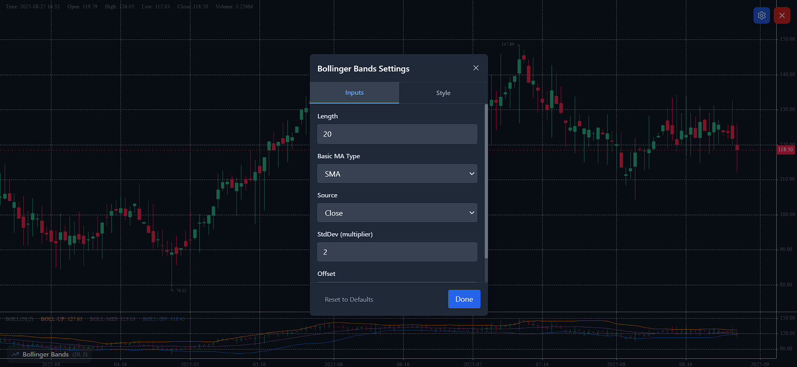

# Bollinger Bands Indicator

A production-ready Bollinger Bands indicator built with Next.js, TypeScript, and KLineCharts. This implementation provides a TradingView-like experience with comprehensive settings and real-time updates.

## Features

### Core Functionality

- **Bollinger Bands Calculation**: Accurate implementation with configurable parameters
- **Real-time Updates**: Instant chart updates when settings change
- **Interactive Crosshair**: Shows Bollinger Bands values on hover
- **Sample Data**: 250 candles of demo OHLCV data

### Configurable Settings

#### Inputs Tab

- **Length**: Period for moving average calculation (default: 20)
- **Basic MA Type**: Moving average type (SMA only, as specified)
- **Source**: Price source (Close, Open, High, Low - default: Close)
- **StdDev (multiplier)**: Standard deviation multiplier (default: 2.0)
- **Offset**: Shift bands by N bars (default: 0)

#### Style Tab

- **Basic (Middle Band)**: Visibility, color, line width, line style
- **Upper Band**: Visibility, color, line width, line style
- **Lower Band**: Visibility, color, line width, line style
- **Background Fill**: Visibility and opacity between upper/lower bands

### Technical Implementation

#### Bollinger Bands Formula

- **Basis (Middle Band)**: SMA(source, length)
- **Standard Deviation**: Sample standard deviation (n-1 denominator)
- **Upper Band**: Basis + (StdDev multiplier × StdDev)
- **Lower Band**: Basis - (StdDev multiplier × StdDev)
- **Offset**: Applied to shift all bands by specified periods

#### Data Requirements

- Minimum 200+ OHLCV candles
- Real-time recalculation on parameter changes
- Proper handling of insufficient data periods

## Getting Started

### Prerequisites

- Node.js 18+
- npm or yarn

### Installation

1. Clone the repository:

```bash
git clone <repository-url>
cd bollinger-bands-indicator
```

2. Install dependencies:

```bash
npm install
```

3. Start the development server:

```bash
npm run dev
```

4. Open [http://localhost:3000](http://localhost:3000) in your browser

### Building for Production

```bash
npm run build
npm start
```

## Usage

1. **View Chart**: The chart loads automatically with default Bollinger Bands settings
2. **Open Settings**: Click the settings icon (⚙️) in the top-right corner
3. **Configure Inputs**: Adjust length, source, multiplier, and offset in the Inputs tab
4. **Customize Style**: Modify colors, line styles, and fill opacity in the Style tab
5. **Real-time Updates**: Changes apply instantly without page refresh
6. **Hover for Values**: Move your cursor over the chart to see Bollinger Bands values

## Technology Stack

- **Framework**: Next.js 14 with App Router
- **Language**: TypeScript
- **Styling**: Tailwind CSS
- **Charting**: KLineCharts
- **Icons**: Lucide React

## Architecture

```
src/
├── app/                    # Next.js app router
├── components/
│   ├── BollingerBandsChart.tsx    # Main chart component
│   └── BollingerBandsSettings.tsx # Settings modal
├── data/
│   └── sampleData.ts      # Demo OHLCV data generation
└── utils/
    └── bollingerBands.ts  # Bollinger Bands calculations
```

## Key Components

### BollingerBandsChart

- Main chart visualization using KLineCharts
- Manages chart state and overlays
- Handles crosshair events for tooltips
- Integrates with settings modal

### BollingerBandsSettings

- Two-tab interface (Inputs/Style)
- Real-time parameter updates
- Reset to defaults functionality
- TradingView-inspired UI design

### Bollinger Bands Calculations

- Efficient SMA and standard deviation calculations
- Proper handling of NaN values for incomplete periods
- Offset application for time-shifted indicators
- Sample standard deviation (consistent with trading platforms)

## Performance

- **Calculation Efficiency**: Optimized for datasets of 200+ candles
- **Memory Management**: Proper cleanup of chart resources
- **Responsive Updates**: Sub-100ms response to setting changes
- **Dark Theme**: Optimized for dark backgrounds

## License

MIT License - see LICENSE file for details

## Contributing

1. Fork the repository
2. Create a feature branch
3. Make your changes
4. Add tests if applicable
5. Submit a pull request

## Support

For issues and questions, please open a GitHub issue with:

- Description of the problem
- Steps to reproduce
- Expected vs actual behavior
- Screenshots if applicable



